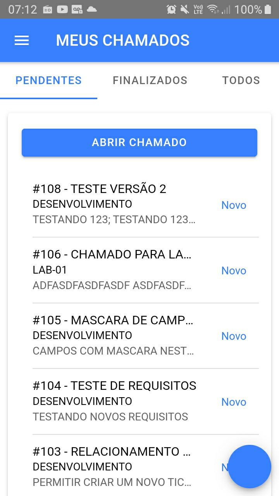

# TicketApp

Este projeto foi desenvolvido como parte do Trabalho de Conclusão de Curso (TCC) do curso de **Sistemas de Informação** da **ESUCRI**, apresentado em Criciúma-SC, em 21/11/2022.

## 📌 Descrição

O **TicketApp** tem como objetivo registrar os chamados pelos usuários dos equipamentos de uma instituição de ensino superior facilitando a comunicação entre os usuários e a equipe técnica de manutenção e suporte. **Este aplicativo se conecta ao Backend do projeto [WNTickets](https://github.com/willianmz/wntickets).**

## 🚀 Tecnologias Utilizadas

- **Frontend:** Ionic Framework, Capacitor
- **Backend (não incluído neste repositório):** C# .NET 6, ASP.NET, ASP.NET Identity
- **Banco de Dados:** PostgreSQL  
- **Ferramentas:** VSCode, Visual Studio, Android Studio

## 📷 Imagens do Sistema

| Tela Principal |
|----------------|
| |

## 👨‍💻 Autor

<table>
  <tr>
    <td align="center">
      <a href="https://github.com/WillianMz">
         
        <b>Willian</b>
      </a>
    </td>
  </tr>
</table>

## 👨‍💻 Orientador
- [Anderson Luís Furlan](https://github.com/andersonlfurlan)

## 📄 Licença

Este projeto está licenciado sob a licença [MIT](LICENSE).
